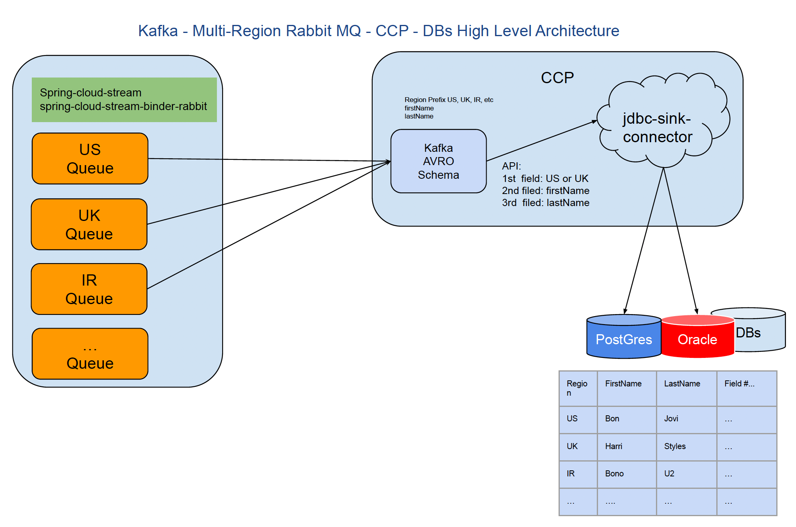

## Multi-Rabbit MQs to Kafka then to PostreSQL or any other db repository High Level View




## Build connector image with JDBC enabled

```
docker build -f Dockerfile-connect . -t connect-with-jdbc
```

## Start all the services

```shell
docker compose up -d
```

It will launch Confluent, Postgres and two instances of RabbitMQ
- first RabbitMQ running on port `5672` with admin on [http://localhost:15672](http://localhost:15672) credentials `guest` + `guest`
- second RabbitMQ running on port `5673` with admin on [http://localhost:15673](http://localhost:15673) credentials `guest` + `guest`

## Start the producer

```shell
mvn -f producer/pom.xml spring-boot:run
```

Publish some events. You can select which broker to publish to. Verify the event count on the RabbitMQ admin dashboards for the two servers.

[http://localhost:8080/publish](http://localhost:8080/publish)

## Confluent control center

1. Go to the Control Center, it will take a couple of minutes to start up [http://localhost:9021](http://localhost:9021)
2. Create a topic `customer-events`. Copy the schema from `customer.avsc` (in the current directory) and set it on the topic.
3. Go to Connect and add a new JDBCSinkConnector. Properties `topics`: `customer-events` , `jdbc url`: `jdbc:postgresql://postgres:5432/customer`, `JDBC User`: `postgres`, `JDBC Password`: `example`, `Database Dialect`: `PostgreSqlDatabaseDialect`, `inser mode`: `insert`, `auto create`: `true`, `auto evolve`: `true`
4. Run the connector

## Start the consumer

```shell
mvn -f consumer/pom.xml spring-boot:run
```

Verify in the logs that the expected events are coming from the right servers

If you make a change to the avro model, and you need to re-generate the schema
```shell
mvn -f consumer/pom.xml generate-sources
```


## Check that the data made it through to Postgres

The password is `example`
```
psql -h localhost --port=5433  -U postgres  customer
```

Show tables. Make sure `customer-events` is there.
```
> \d
```

List events
```
SELECT * from "customer-events";
```


## Close everything down

```shell
docker compose down
```
